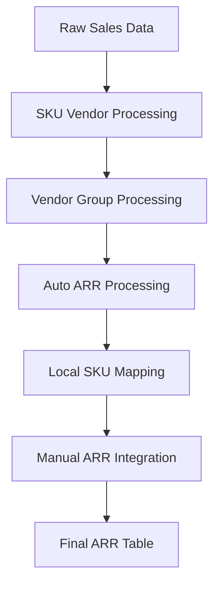
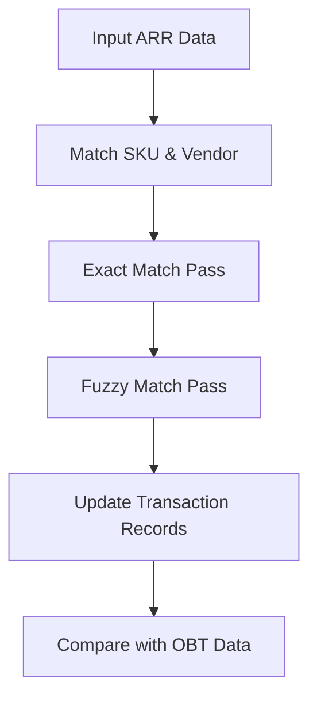

# 💰 ARR Data Load Overview

## Summary 
There are 2 parts to the load routine:
1. [⚡ ARR Data Mapping Process](#arr-data-mapping-process)
   - Standardizes SKU and vendor data
   - Maps local SKUs to manufacturer SKUs
   - Handles automated and manual mappings
   - Maintains match type classifications (auto/child/manual)

2. [🔄 Global Transactions Update](#global-transactions-update)
   - Processes transaction data with mapped ARR attributes
   - Multiple match passes (exact & fuzzy)
   - Updates transactions with standardized:
     - Product types
     - Duration values
     - Billing frequencies
     - Consumption models
   - Quality control comparison with OBT platform

## Key Features
- Automated attribute mapping
- Fuzzy matching with configurable thresholds
- Audit trail with match type tracking
- Revenue impact analysis
- Quality control checks


# ⚡ARR Data Mapping Process {#arr-data-mapping-process}
📄nb-orion-process-arr-auto.py (data prep)

This code implements an automated process for mapping and standardizing Annual Recurring Revenue (ARR) attributes across different data sources. Here's the key workflow:



## Key Processing Steps

1. **SKU Vendor Processing**
- Extracts sales data from invoice lines and credit memos
- Joins with item master data
- Identifies duplicate records based on manufacturer SKU and vendor code
- Creates staging table `arr_sku_vendor_stg`

2. **Vendor Group Processing**
- Processes vendor master data 
- Handles vendor code duplicates
- Creates `arr_vendor_group` tables

3. **Auto ARR Processing**
- Applies business rules for:
  - Duration mapping
  - Billing frequency
  - Consumption models
  - Product types
- Vendor-specific transformations
- Creates `arr_auto_stg` and `arr_auto_1`

4. **Local SKU Mapping**
- Maps local SKUs to manufacturer SKUs
- Adds match type classifications:
  - auto: automated mapping
  - child: local SKU mapped to manufacturer SKU
  - manual: mapped through manual data sheet

5. **Manual Integration**
- Integrates manual mappings from master data
- Compares automated vs manual results
- Resolves conflicts using match type hierarchy

6. **Generate a Final ARR Table**
- create an output table used by the second half of the process `arr_auto_3`

The process uses multiple quality checks and staging tables throughout to maintain data integrity and provide audit trails.

# 🔁 Global Transactions Update {#global-transactions-update}
ARR Data Processing and Matching System

📄nb-orion-process-arr.py (matching)



## Core Components

7. **Data Preparation**
- Transform ARR attributes 
- Standardize vendor names
- Clean SKU formats

8. **Match Strategy**
- Multiple matching passes:
  - SKUInternal → VendorNameInternal (exact)
  - SKUInternal → VendorNameMaster (exact)
  - SKUInternal → VendorNameMaster (fuzzy)
  - SKUMaster → VendorNameMaster (exact)

9. **Matching Process**
```python
def udf_run_match(df, x, control_col, match_col, threshold):
    # Exact match (threshold=1)
    # Fuzzy match (threshold<1)
    # Update matched records
    # Return updated dataset
```

10. **Key Outputs**
- Matched type flags
- Match confidence scores
- Updated ARR attributes: 
  - Product type
  - Duration
  - Billing frequency
  - Consumption model

11. **Quality Control**
- Compare with OBT platform
- Track match ratios
- Revenue impact analysis

## 📑 File Dependencies
- nb-orion-common (utilities)
- nb-orion-process-arr-auto.py (data prep)
- nb-orion-process-arr.py (matching)

Key performance metrics tracked at entity and vendor level after matching process completes.