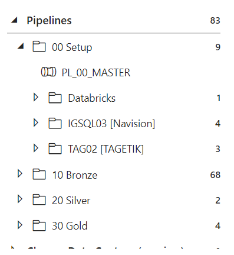
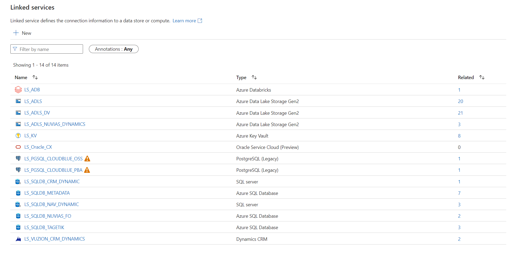
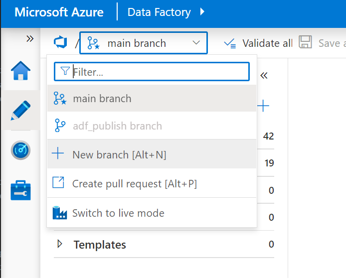
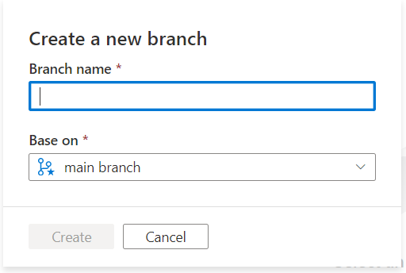
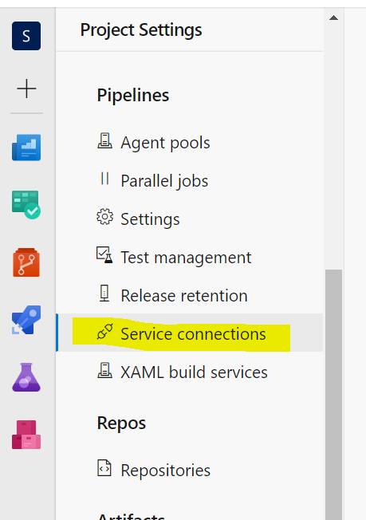
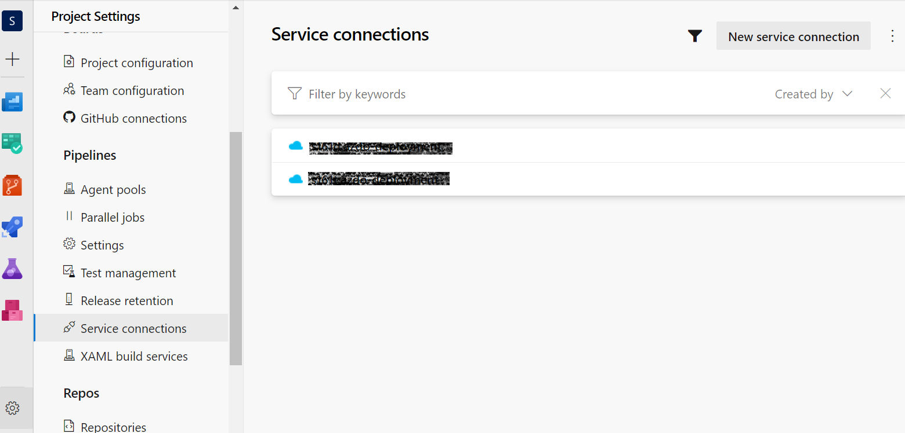
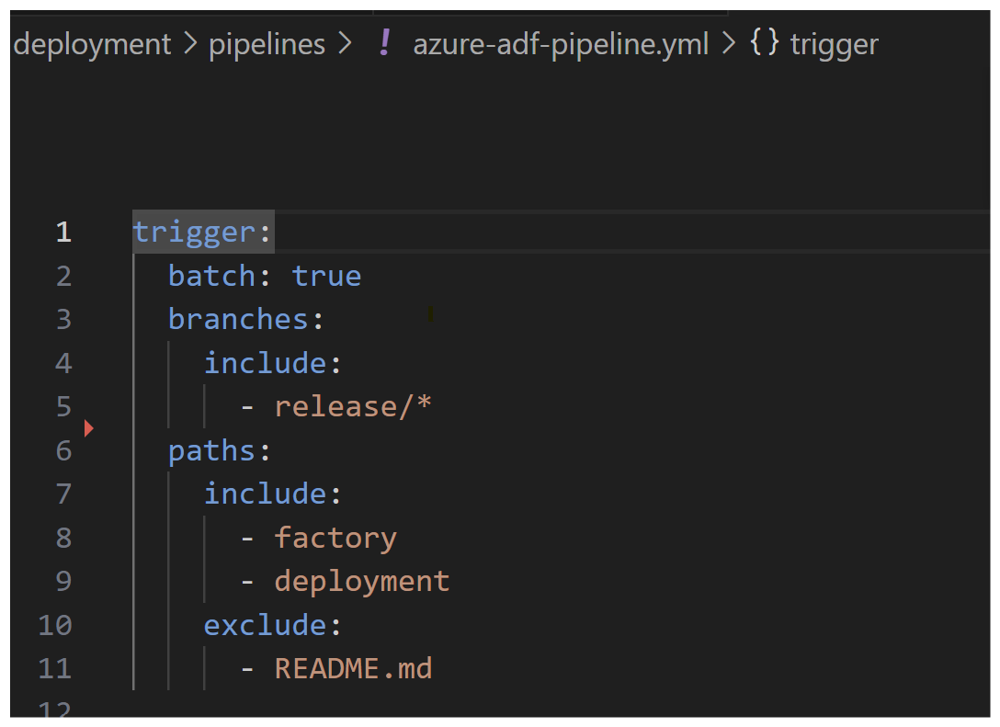

# Introduction

This Solution provides a CICD for the Data Engineering Data Factory solution. the ADF solution is maintained within ADF native Repository management feature. Merges into the uat branch will initiate a deployment to the UAT environment

# ADF Overview
The ADF pipelines have been categorised into the following folders

The Numbered Naming convention helps identify the order of the Data flow and also to find the package in the Web IDE

The Linked services used to link to the core resources of the applications are

- ls_kv
- ls_adls
- ls_adls_dv
- ls_adb
- ls_sqldb_metadata

the other are connections to external data sources used during the extraction phase 

devs will continue added to the Linked Service COnnectors so you can expect this external list to grow

# Getting Started

There are some prerequisites & build consider before running this project

1. As mentioned, the ADF repo features handles management of the source code
2. At the time of writing the Development ADF solution is sitting within [Dev ADF](https://adf.azure.com/en/home?factory=%2Fsubscriptions%2F5c771a6b-7686-4067-a58d-95551c37bf46%2FresourceGroups%2Frg-ig-lakehouse-dev-westeurope%2Fproviders%2FMicrosoft.DataFactory%2Ffactories%2Fadf-ig-dev-westeurope)
3. Developers are advised to branch off the main code 

   opens to

   

4. Regularly perform commits of your OWN Branch
5. Having a single moderator to merge branches to Main will minimise conflicts

# Installation Guide

1. Installation process

2. create SPN on azureportal (1 for every envorinment that you deploy to)
   [Group IT Program](https://dev.azure.com/InfinigateHolding/Group%20IT%20Program/_settings/adminservices)

- Navigate to the Settings window

- click through to Service Connection  
  
- these are the environments currently used Dev, UAT, Prod
  
  - these are as follows:
    - SC-ARM-EDW-DEV
    - SC-ARM-EDW-UAT
    - SC-ARM-EDW-PROD

3. the SPN's are associated to each deployment which need to be set in the azure-adf-pipline.yml
4. setup the DevOps groups Vairables in the Library. the variable group used in this solution is vg-inf-edw-deployment
5. setup requires that once the datafactory is released, the System Assigned Managed Identy [s161...-uami-adf-platform] used by the ADF needs to be added to a Data Reader Group within Entra

# CICD Release guide
the main branch holds the latest code of the data ware house solution
1. create a feature branch off the main branch
2. once changes are added to the feature and your interactive tests are complete, create a PR from the feature into main
3. the main branch should then be published into dev to allow the trigger jobs to pickup changes as it reference the adf_publish branch
4. create a PR from main into the testing branch, completion of this will trigger the deployment process to the respective environment, provided that the factory folder or the deployment folder has been changed.
4. create a PR from testing into the prod branch, completion of this will trigger the deployment process to the respective environment, provided that the factory folder or the deployment folder has been changed.
**filter paths are used to specifiy what folders trigger the Deployment
  
7. note: the ADF paramaters might be dependant on the enviornment the solution is deployed to. using the files below will help override values for environment specific paramaters. As a general guideline, the static datasources must be repointed their respected enviornments

- [arm-template-parameters-uat.json](/factory/arm-template-parameters-uat.json)
- [arm-template-parameters-test.json](/factory/arm-template-parameters-test.json)
- [arm-template-parameters-prod.json](/factory/arm-template-parameters-prod.json)
  - there are dynamic paramters that are set to populated the template. currenyl there is only 1 dynamic variable. this can be extended -[subscriptionId]-[env]
  - the overrides occur during the azure-build.yml step
8. Similarly Global Paramaters are deployed through the CICD. Refer to the 
- [arm-template-GlobalParameters-uat.json](/factory/arm-template-parameters-uat.json)
- [arm-template-GlobalParameters-test.json](/factory/arm-template-parameters-test.json)
- [arm-template-GlobalParameters-prod.json](/factory/arm-template-parameters-prod.json)
  - Ensure these files are populated accordingly, as they add and override the target paramaters 
9. ADF can be updated incrementally or as a complete deployment. 
- incremental deployment only adds or ammends pipelines but doesnt remove residual pipeline
- complete on the other hand adds, updates and deletes pipeline so that the target deployment is an exact copy of the solution within the DevOps repository.

\*\*NOTE

- if the databricks projects CICD changes the workspace id, jobs or other core objects, you will need to update the [arm-template-parameters-....json] file for [gpm_Databricks_...] values
