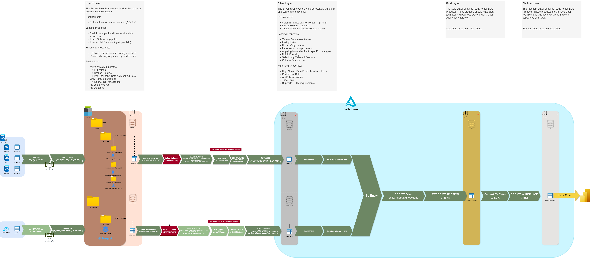

# Overview
This is the official project wiki for the enterprise data warehouse. Everything which is needed to either gain an overview or to start developing should be found here. If there is anything missing give a shout to the project team.

## Base Information
**Project Owner:** Thys van de Luijster (Head of BI & Analytics)

**Project Manager:** Jason Milner

**Lead Architect:** Kevin Sames (drjve AG)

**Project Team:** BI and Data Analytics

**Project Board:** [Azure Boards](https://dev.azure.com/InfinigateHolding/Group%20IT%20Program/_backlogs/backlog/BI%20and%20Data%20Analytics/Stories)

**Azure Repository:** [inf-edw](https://dev.azure.com/InfinigateHolding/Group%20IT%20Program/_git/inf-edw)

**Azure Subscriptions:** [HLD 03 Invoice EDW DEV](https://portal.azure.com/#@Infinigate.onmicrosoft.com/resource/subscriptions/5c771a6b-7686-4067-a58d-95551c37bf46/overview), [HLD 03 Invoice EDW UAT](https://portal.azure.com/#@Infinigate.onmicrosoft.com/resource/subscriptions/bf75b24f-2b10-4ada-a25a-b5bec3311486/overview), [HLD 03 Invoice EDW PROD](https://portal.azure.com/#@Infinigate.onmicrosoft.com/resource/subscriptions/4b6b9329-18aa-4bf0-83f2-090c052e7fd3/overview)

**Entra ID Groups:** [az_edw_XX](https://portal.azure.com/#view/Microsoft_AAD_IAM/GroupDetailsMenuBlade/~/Overview/groupId/b932db11-91b3-42c1-8af6-a29fc8fbd89d/menuId/)
## Table of Contents
 - [Developer Guidelines](developer_guidelines.md)
 - [Security Setup](security_setup.md)
 - Data Products
    - OBT
    - [Orion](Orion.md)
# Medallion Architecture

---
# Change History
- v0.01 14.09.2023 Initialize
- v0.10 13.11.2023 Created Dev Guidelines for AKV and ADF